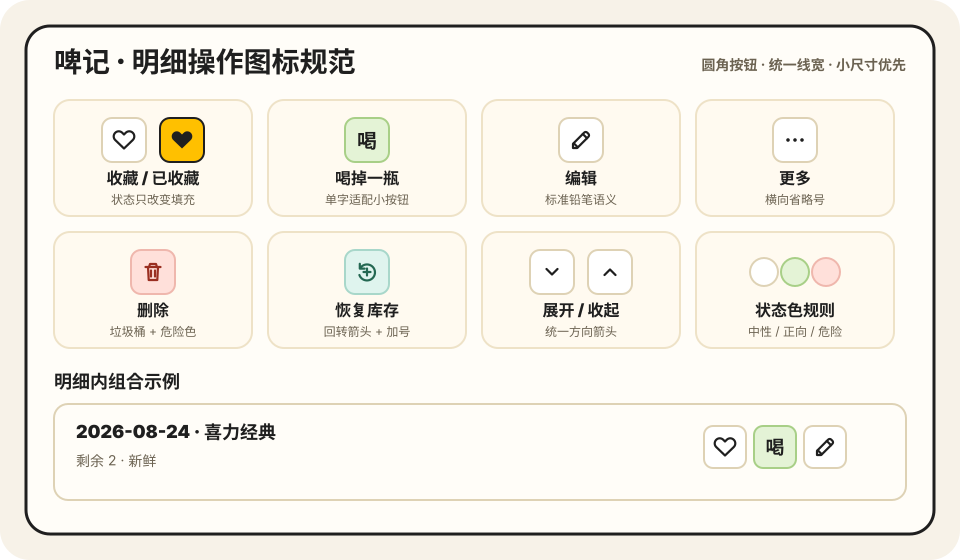

# 啤记

啤记是一款本地优先的个人啤酒库存与饮用记录微信小程序。产品目标是：库存可信、回看方便、备份可恢复。

## 1.0 能力

- 家里库存、喝过记录、喜欢列表和酒吧记录
- 酒厂、风格、啤酒花资料库与常用项管理，以及统一的搜索/最近使用选择器
- 酒标正反面拍摄与腾讯云 TokenHub 信息提取
- 明确区分生产/罐装日期与到货日期
- 携照片的完整 JSON 备份、微信文件发送和文件恢复
- 本地数据与照片一键清理
- 无广告、无测试账号、无默认示例数据

## 本地验收

```bash
npm run check:release
```

检查包含 JavaScript/JSON 语法、发布配置、公开文案、新用户数据隔离，以及携照片备份恢复闭环。

## 云能力

酒标识别通过微信云开发函数调用 TokenHub 的 `glm-5v-turbo`，项目基础库固定为 `3.15.1`。API Key 仅保存在云函数环境变量 `TOKENHUB_API_KEY` 中，不能写入小程序源码。未开通云能力时，其余手动入库和本地记录功能仍可正常使用。

当前生产环境已部署 `recognizeBeerLabel` 云函数并配置服务端环境变量；TokenHub 仅启用了该模型的免费体验，后付费保持关闭。后续复核与发布操作见 [RELEASE_CHECKLIST.md](./RELEASE_CHECKLIST.md)。

## 数据策略

业务记录和用户手动保存的照片默认只保存在本机。只有用户主动点击“拍照识别”时，所选酒标照片才会经 CloudBase 云函数发送到 TokenHub；识别结果不会自动保存。完整备份文件会在用户主动生成时把本机照片嵌入备份。

本项目 1.0 不包含自动跨设备同步。换设备前应生成完整备份并通过微信发送给自己，再在新设备中导入。

## 明细操作图标规范

酒窖与酒吧“明细”中的操作按钮采用同一套小尺寸图标系统：中性操作使用白色底板，正向操作使用绿色，删除使用红色，收藏选中使用品牌黄色。“喝掉一瓶”属于产品特有动作，为避免小图标含义不清，直接使用单字“喝”。



- 收藏：空心爱心；选中后切换为黄色底板和实心爱心。
- 喝掉一瓶：绿色“喝”字按钮，点击后库存减少一瓶并进入原有评分流程。
- 编辑与更多：分别使用铅笔和横向省略号。
- 删除：使用红色垃圾桶，只用于破坏性操作。
- 恢复库存：使用回转箭头与加号，仅出现在已喝记录的更多操作中。
- 展开与收起：使用方向一致的上下箭头。

小程序实际使用的独立矢量资源位于 [`assets/icons`](./assets/icons)。

## 选项资料库、常用选项与统一选择器

酒窖入库和酒吧打卡共用同一套酒厂、风格、啤酒花选择器，支持用户提前维护完整资料库和常用快捷项、按历史记录生成最近使用、搜索标准选项和在选择时继续新建资料。啤酒花采用多选后确认，酒厂与风格采用单选即回填。

资料库与常用项的入口、编辑规则、显示语言兼容和备份策略见 [选项资料库、常用选项与统一选择器产品规范](./docs/common-options-selectors.md)。
